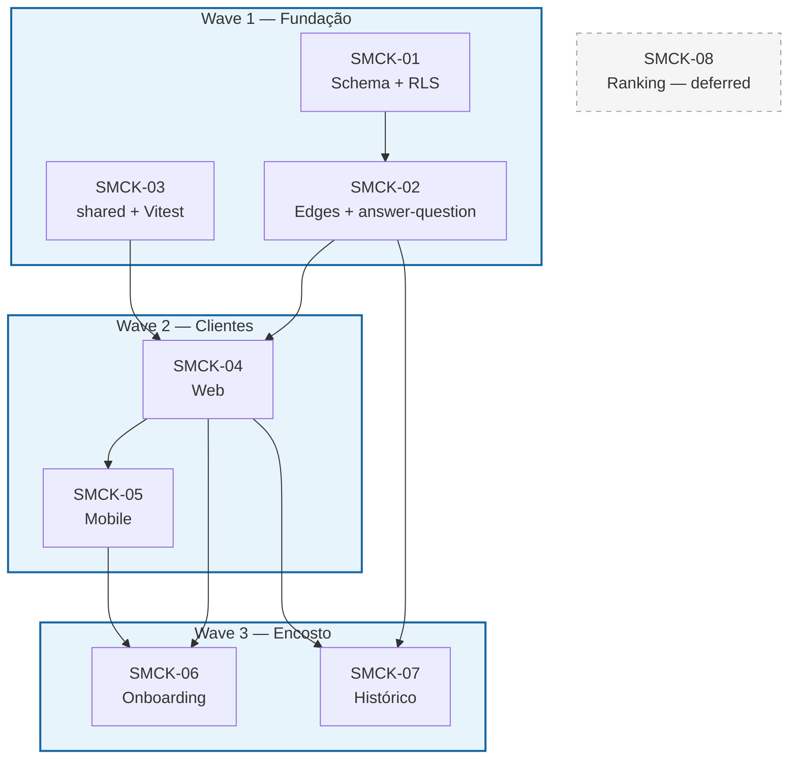
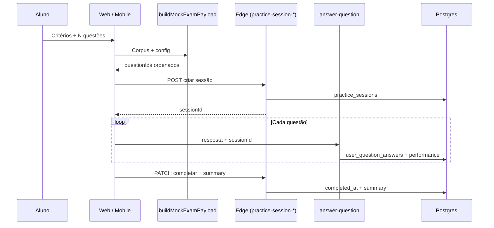

<objective>
Implementar o **simulado ENEM autogerido pelo aluno**: configuração de critérios, geração de lista a partir do corpus estático existente, execução no `QuestionPlayer`, persistência de sessão (`practice_sessions`), resultados agregados e paridade web/mobile. Atende **SMCK-01** … **SMCK-07**; **SMCK-08** fica explícito como fase posterior (ranking/percentis).

Referência de contexto: `docs/plan-simulado-enem-aluno.md`, `docs/broto-sistema-completo.md`, `docs/onboarding-flow.md`.
</objective>

## Convenção de requisitos (time)

| Padrão | Exemplo | Onde vive |
|--------|---------|-----------|
| `AAAA-NN` — prefixo de **4 letras** + hífen + **2 dígitos** | `SMCK-03`, `TOOL-01` | [.planning/REQUIREMENTS.md](../../REQUIREMENTS.md) |
| Família **SMCK** (*student mock*) | **SMCK-01** … **SMCK-08** | Este phase + doc `docs/plan-simulado-enem-aluno.md` |
| Cross-cutting | **ONBR-02** (diagnóstico pós-onboarding) | Tarefa 6 encosta em onboarding |

Tarefas abaixo citam o ID no `<name>` e repetem em *acceptance_criteria* quando o requisito é o critério principal.

## Ondas e dependências (SMCK)

| Wave | Requisitos | Entrega |
|------|------------|---------|
| **W1 — Fundação** | SMCK-01, SMCK-02, SMCK-03 | Schema + API + `buildMockExamPayload` testado |
| **W2 — Produto** | SMCK-04, SMCK-05 | Web + mobile MVP (config → player → resultado) |
| **W3 — Entrada e histórico** | SMCK-06, SMCK-07 | Onboarding + lista de sessões |
| **Backlog** | SMCK-08 (Deferred) | Ranking/percentis — não entra no wave 1 |

## Matriz requisito ↔ tarefa

| ID | Tarefa no `<tasks>` | Notas |
|----|---------------------|--------|
| **SMCK-01** | Task 1 | Migração + `session_id` + RLS |
| **SMCK-02** | Task 2 | `practice-session-*` + validação de posse em `answer-question` |
| **SMCK-03** | Task 3 | Tipos + `buildMockExamPayload` + Vitest |
| **SMCK-04** | Task 4 | Web |
| **SMCK-05** | Task 5 | Mobile |
| **SMCK-06** | Task 6 | Manual — liga ONBR-02 |
| **SMCK-07** | Task 7 | GET histórico + UI mínima |
| **SMCK-08** | Task 8 | Manual — só documentar backlog |

<context>
@docs/plan-simulado-enem-aluno.md
@.planning/REQUIREMENTS.md
@packages/shared/src/types/question.ts
</context>

<tasks>

<task type="auto">
  <name>Task 1 (SMCK-01): Migração practice_sessions + session_id em respostas + RLS</name>
  <files>supabase/migrations/</files>
  <read_first>
    - supabase/migrations/ (padrão PR08 / user_question_answers)
    - docs/plan-simulado-enem-aluno.md §5
  </read_first>
  <action>
    1. Criar tabela `practice_sessions` com colunas: `id`, `user_id`, `created_at`, `completed_at`, `kind` (ex.: `student_mock`), `config` jsonb, `question_ids` (jsonb ou text[]), `summary` jsonb nullable.
    2. Adicionar `session_id uuid NULL REFERENCES practice_sessions(id)` em `user_question_answers` (ou nome alinhado ao schema existente).
    3. Políticas RLS: dono do aluno para SELECT/INSERT/UPDATE em `practice_sessions`; staff conforme matriz existente de respostas.
    4. Documentar nome final da tabela se o produto preferir outro termo (ex. `mock_exam_sessions`).
  </action>
  <verify>
    <automated>`supabase db diff` ou aplicação local da migration sem erro</automated>
  </verify>
  <acceptance_criteria>
    - Migração idempotente e revisável em PR
    - RLS espelha o padrão de `user_question_answers` / PR08
    - Coluna `session_id` aceita NULL para fluxo legado de questões avulsas
  </acceptance_criteria>
  <done>Schema pronto para persistir sessões de simulado e vincular respostas.</done>
</task>

<task type="auto">
  <name>Task 2 (SMCK-02): Edge functions practice-session + extensão answer-question</name>
  <files>supabase/functions/</files>
  <read_first>
    - packages/shared/src/api/api-client.ts (pathToFunctionName)
    - supabase/functions/_shared/authz.ts
    - supabase/functions/answer-question/index.ts
  </read_first>
  <action>
    1. Implementar invocações REST mapeadas para edge: criar sessão (POST body com config + question_ids gerados no cliente **ou** validação server-side mínima — ver decisão em Task 3 se geração for só client).
    2. PATCH/POST para completar sessão com `summary` + `completed_at` (idempotente).
    3. Em `answer-question`, aceitar `sessionId` opcional no JSON; validar que a sessão pertence ao `user.id` antes de gravar `session_id` na linha de `user_question_answers`.
    4. CORS: reutilizar utilitário compartilhado existente.
  </action>
  <verify>
    <manual>Invoke local ou staging: criar sessão → responder com sessionId → completar sessão</manual>
  </verify>
  <acceptance_criteria>
    - Erros retornam `{ error: string }` e status HTTP adequados
    - Não é possível anexar respostas a sessão de outro usuário
  </acceptance_criteria>
  <done>API server-side consistente com o contrato mobile/web.</done>
</task>

<task type="auto">
  <name>Task 3 (SMCK-03): @broto/shared — tipos e buildMockExamPayload + testes</name>
  <files>packages/shared/src/</files>
  <read_first>
    - apps/web/src/hooks/useQuestionsFilters.ts (filtros e limites de ano)
    - packages/shared/src/types/question.ts
  </read_first>
  <action>
    1. Definir `StudentMockExamConfig`, `PracticeSessionSummary` (shape mínimo para summary), helpers que não importem React — incluir flag ou preset **modo aleatório** (aluno escolhe só N; áreas/tópicos/dificuldades amostrados do corpus conforme política de produto).
    2. Implementar `buildMockExamPayload(config, preloadedQuestions): { questionIds, questions }` com: deduplicação por `getQuestionId`, amostragem estratificada por área quando múltiplas áreas explícitas, tratamento de pool menor que N com erro tipado; no modo aleatório, amostra uniforme (ou ponderada) sobre o universo permitido.
    3. Vitest: casos — pool vazio, pool menor que N, multisseleção de tópicos, anos válidos.
  </action>
  <verify>
    <automated>cd packages/shared && npm test</automated>
  </verify>
  <acceptance_criteria>
    - Web e mobile importam apenas de `@broto/shared` para a regra de sorteio
    - Cobertura mínima nos edge cases de pool
  </acceptance_criteria>
  <done>Lógica de geração centralizada e testada.</done>
</task>

<task type="auto">
  <name>Task 4 (SMCK-04): Web — configurar simulado, player, resultado</name>
  <files>apps/web/src/</files>
  <read_first>
    - apps/web/src/pages/StudyArea.tsx / fluxo de questões existente
    - apps/web/src/components/QuestionPlayer.tsx (se existir; ajustar nome real)
  </read_first>
  <action>
    1. Rota/página: formulário de critérios (reutilizar padrões de área/tópico já existentes).
    2. Após gerar lista: navegar para player com fila fixa; cada submissão chama `answer-question` com `sessionId`.
    3. Ao terminar: chamar conclusão de sessão + tela de resultado (por área, tópico, tempo médio).
    4. Filtro de dificuldade: só exibir se metadados existirem (ver docs/plan §6).
  </action>
  <verify>
    <manual>Fluxo completo no browser</manual>
  </verify>
  <acceptance_criteria>
    - Critérios de aceite em docs/plan-simulado-enem-aluno.md §10 atendidos no web
  </acceptance_criteria>
  <done>Experiência web shippable para o MVP do simulado.</done>
</task>

<task type="auto">
  <name>Task 5 (SMCK-05): Mobile — paridade com web</name>
  <files>apps/mobile/</files>
  <read_first>
    - apps/mobile/app/(tabs)/questions.tsx
    - apps/mobile/hooks/use-questions-filters.ts
  </read_first>
  <action>
    1. Telas Expo Router equivalentes (config → player → resultado).
    2. `api.post` / invoke alinhados aos novos paths de edge.
    3. Mesmos limites e mensagens de erro que a web.
  </action>
  <verify>
    <manual>Fluxo completo no simulador/dispositivo</manual>
  </verify>
  <acceptance_criteria>
    - Paridade de geração (mesmos IDs com mesma config e seed de sessão quando aplicável)
  </acceptance_criteria>
  <done>Mobile alinhado ao MVP.</done>
</task>

<task type="manual">
  <name>Task 6 (SMCK-06): Onboarding — CTA simulado diagnóstico</name>
  <files>apps/web/src/pages/Onboarding.tsx, apps/mobile/app/onboarding.tsx</files>
  <action>
    Substituir TODO por navegação para o fluxo de simulado com **config fixa** documentada (ex. 20 questões, 5 por área) ou deep link com query de defaults — fecha parte de **ONBR-02** em conjunto com SMCK.
  </action>
  <acceptance_criteria>
    - "Fazer simulado" abre o fluxo real; "Começar sem simulado" inalterado em intenção
  </acceptance_criteria>
  <done>Diagnóstico pós-onboarding funcional.</done>
</task>

<task type="auto">
  <name>Task 7 (SMCK-07): Histórico de simulados do aluno</name>
  <files>apps/web/src/, apps/mobile/, supabase/functions/</files>
  <action>
    1. Edge GET (ou RPC) listando `practice_sessions` do usuário com `kind = student_mock`, ordenado por data.
    2. UI mínima: lista com data, percentual, link para detalhe opcional (MVP: só lista e último resumo).
  </action>
  <acceptance_criteria>
    - Apenas o dono vê suas sessões; payloads sem dados de terceiros
  </acceptance_criteria>
  <done>MVP+ de histórico disponível.</done>
</task>

<task type="manual">
  <name>Task 8 (SMCK-08): Ranking e percentis — backlog explícito</name>
  <action>
    Não implementar no MVP. Documentar dependências: opt-in LGPD, agregações, volume mínimo de dados, design de UX.
  </action>
  <acceptance_criteria>
    - Item rastreável em backlog ou REQUIREMENTS como Deferred
  </acceptance_criteria>
  <done>Escopo futuro amarrado sem scope creep no wave 1.</done>
</task>

</tasks>
