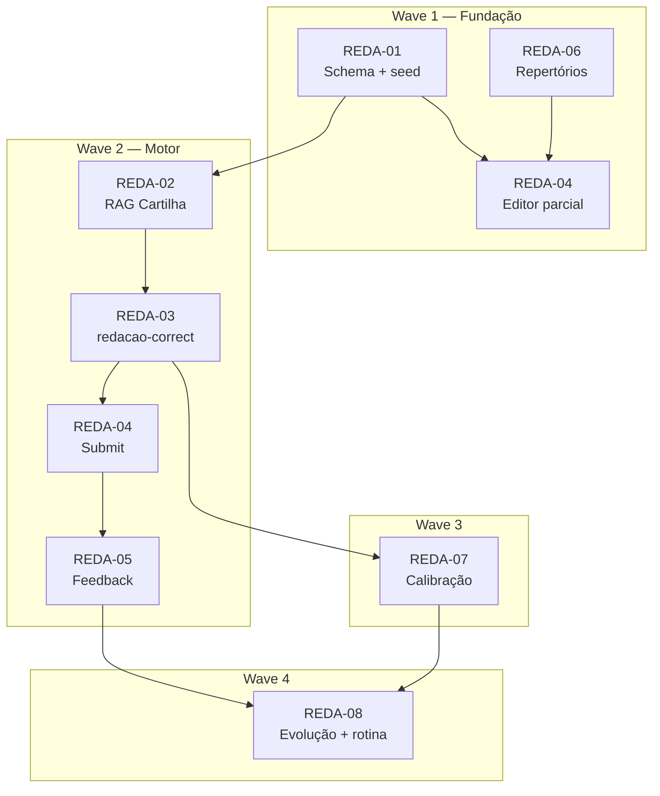

<objective>
Implementar o módulo de redação ENEM no Broto: temas, editor, repertórios, motor de correção ancorado na Cartilha INEP via RAG, feedback inline, calibração humana, evolução e integração com rotina.

Referências: `docs/redacao.md`, `docs/redacao-contexto-dev.md`, `docs/redacao-arquitetura-motor.md`.
</objective>

## Convenção de requisitos

| ID | Escopo |
|----|--------|
| **REDA-01** | Schema + RLS + seed temas |
| **REDA-02** | Corpus RAG Cartilha INEP (`enem_reference_*`) |
| **REDA-03** | Motor de correção (`redacao-correct`) |
| **REDA-04** | Editor + submit + listagem temas |
| **REDA-05** | Tela feedback (marcações inline) |
| **REDA-06** | Repertórios (admin CRUD + consulta aluno) |
| **REDA-07** | Calibração humana (painel interno) |
| **REDA-08** | Evolução + integração rotina |

## Ondas

| Wave | Requisitos | Prazo | Entrega |
|------|------------|-------|---------|
| **W1 — Fundação** | REDA-01, REDA-06 | 1–2 sem | Migrations, temas seed, repertórios, editor básico |
| **W2 — Motor** | REDA-02, REDA-03, REDA-04, REDA-05 | 3–4 sem | RAG Cartilha, correção, submit, feedback |
| **W3 — Calibração** | REDA-07 | paralelo | Revisão humana cega + métricas |
| **W4 — Ciclo** | REDA-08 | 2 sem | Evolução + rotina |
| **Backlog** | — | pós-MVP | OCR (Fase 5), painel institucional (Fase 6) |



---

## Wave 1 — Fundação (REDA-01, REDA-06, editor parcial)

### Tarefa 1.1 — Migrations e RLS (REDA-01)

**Objetivo:** criar schema completo com RLS fail-closed.

**Arquivos:**
- `supabase/migrations/YYYYMMDDHHMMSS_redacao_module.sql`

**Tabelas:** `redacao_temas`, `redacoes`, `redacao_correcoes`, `redacao_revisoes_humanas`, `redacao_repertorios`, `redacao_competence_snapshots`

**Critérios de aceite:**
- [ ] RLS conforme `docs/redacao-arquitetura-motor.md` §10
- [ ] `database.types.ts` regenerado
- [ ] Tipos shared em `packages/shared/src/types/redacao.ts`
- [ ] Seed: ≥8 temas globais (1 por eixo temático)

**Prompt sugerido:**
```
Implemente REDA-01: migration do módulo redação conforme
docs/redacao-arquitetura-motor.md e docs/redacao-contexto-dev.md §4.
Inclua seed de temas globais. Tipos em @broto/shared. RLS fail-closed.
```

---

### Tarefa 1.2 — Repertórios admin + consulta aluno (REDA-06)

**Objetivo:** professor CRUD repertórios; aluno lista no editor.

**Arquivos:**
- `supabase/functions/redacao-repertorio-list/`
- `supabase/functions/redacao-repertorio-manage/`
- `apps/admin/src/` (aba Redação ou ClassDetail)
- `packages/shared/src/types/edge-functions.ts`

**Critérios de aceite:**
- [ ] Teacher+ cria/edita/desativa repertórios (org ou turma)
- [ ] Aluno vê repertórios filtrados por org/turma + eixo + competência
- [ ] Authz via `requireMembership` / `requireClassAccess`
- [ ] Padrão similar a `useMaterials` no admin

---

### Tarefa 1.3 — Editor + listagem temas (REDA-04 parcial)

**Objetivo:** fluxo de escrita sem correção ainda.

**Arquivos:**
- `supabase/functions/redacao-tema-list/`
- `apps/web/src/pages/redacao/RedacaoListPage.tsx`
- `apps/web/src/pages/redacao/RedacaoEditorPage.tsx`
- `apps/web/src/router.tsx`

**Critérios de aceite:**
- [ ] Rotas `/redacao` e `/redacao/tema/:temaId`
- [ ] Contador de linhas 7–30 em tempo real
- [ ] Tema + motivadores fixos visíveis
- [ ] Sidebar repertórios (REDA-06)
- [ ] Timer opcional; sem autocorreção agressiva
- [ ] Salvar rascunho (`status=rascunho`)
- [ ] Entrada na Home ou tab bar

---

## Wave 2 — Motor (REDA-02, REDA-03, REDA-04, REDA-05)

### Tarefa 2.1 — Corpus RAG Cartilha INEP (REDA-02)

**Objetivo:** indexar Cartilha em `enem_reference_*`.

**Arquivos:**
- `supabase/migrations/YYYYMMDDHHMMSS_enem_reference_rag.sql`
- `supabase/functions/_shared/enem-reference-search.ts`
- `supabase/functions/_shared/enem-reference-index.ts`
- `supabase/functions/enem-reference-index/`
- `supabase/scripts/index-enem-cartilha.ts`

**Critérios de aceite:**
- [ ] RPC `match_enem_reference_chunks` com filtro competência/seção
- [ ] Chunking semântico com metadata (ver arquitetura §4)
- [ ] Script de indexação documentado (PDF não commitado)
- [ ] Testes Deno para formatEnemReferenceContext
- [ ] Reusar `embedTexts` + `formatPgvector`

---

### Tarefa 2.2 — Lógica pura de validação (REDA-03 prep)

**Objetivo:** validação testável antes do motor.

**Arquivos:**
- `packages/shared/src/redacao/validate-correction.ts`
- `packages/shared/src/redacao/normalize-marcacoes.ts`
- `packages/shared/src/redacao/clamp-nota.ts`
- `packages/shared/src/redacao/check-fatores-zero.ts`
- `packages/shared/src/redacao/*.test.ts`

**Critérios de aceite:**
- [ ] `clampNota` → múltiplos de 40
- [ ] `checkLinhaCountZeroFactor` → determinístico se < 7
- [ ] `normalizeMarcacoes` corrige offsets via fuzzy match
- [ ] Vitest verde (`npm run test:shared`)

---

### Tarefa 2.3 — Motor de correção (REDA-03)

**Objetivo:** edge `redacao-correct` com pipeline 6 chamadas.

**Arquivos:**
- `supabase/functions/redacao-correct/index.ts`
- `supabase/functions/_shared/redacao-correct-core.ts`
- `supabase/functions/_shared/redacao-prompts.ts`
- Estender `openai-chat.ts` (temperature, response_format)

**Critérios de aceite:**
- [ ] Passo 1: fatores zero + RAG `fatores_zero`
- [ ] Passos 2–6: competências I–V com RAG filtrado
- [ ] Temp 0.1, JSON mode
- [ ] Persiste `redacao_correcoes` + snapshots
- [ ] `prompt_version`, `rag_chunks_used`, `modelo_usado`
- [ ] Competência V: instrução estrutural (não política)
- [ ] Testes: 3 redações (fraca/média/forte) diferenciam notas
- [ ] Teste consistência: mesma redação 10×, documentar σ

**Prompt sugerido:** ver `docs/redacao.md` Prompt 2.

---

### Tarefa 2.4 — Submit + integração (REDA-04 completo)

**Objetivo:** envio dispara correção sync.

**Arquivos:**
- `supabase/functions/redacao-submit/`
- `supabase/functions/redacao-get/`

**Critérios de aceite:**
- [ ] Valida ≥7 linhas, ≤30 linhas
- [ ] Calcula `linha_count`
- [ ] Chama `redacao-correct` inline (timeout ~45s)
- [ ] Status: enviada → corrigindo → corrigida | erro
- [ ] Tipos em `edge-functions.ts`
- [ ] Web usa `api-client` com retry JWT

---

### Tarefa 2.5 — Tela de feedback (REDA-05)

**Objetivo:** feedback inline acionável.

**Arquivos:**
- `apps/web/src/pages/redacao/RedacaoResultadoPage.tsx`
- Componentes: `CompetenciaNotaCard`, `RedacaoTextoMarcado`

**Critérios de aceite:**
- [ ] Rota `/redacao/resultado/:redacaoId`
- [ ] 5 competências + destaque da mais fraca
- [ ] Texto com highlights clicáveis (marcações inline)
- [ ] Banner fatores zero se detectado
- [ ] Justificativas em linguagem acessível
- [ ] CTAs: "reescrever tema" / "praticar competência fraca"
- [ ] Repertórios sugeridos por competência fraca

**Prompt sugerido:** ver `docs/redacao.md` Prompt 4.

---

## Wave 3 — Calibração (REDA-07)

### Tarefa 3.1 — Revisão humana cega

**Arquivos:**
- `supabase/functions/redacao-revisao-humana/`
- Painel interno (admin ou app separado staff)

**Critérios de aceite:**
- [ ] Revisor NÃO vê nota IA antes de submit
- [ ] Após submit: comparação IA vs. humano por competência
- [ ] Painel agregado: diferença média absoluta por competência
- [ ] Teste: nota IA oculta até `notas_ia_reveladas_em`

**Prompt sugerido:** ver `docs/redacao.md` Prompt 5.

---

## Wave 4 — Ciclo (REDA-08)

### Tarefa 4.1 — Evolução + rotina

**Arquivos:**
- `supabase/functions/redacao-history/`
- `apps/web/src/pages/redacao/RedacaoEvolucaoPage.tsx`
- Integração em `routine-generate` ou hook `useRedacaoRecommendations`

**Critérios de aceite:**
- [x] Rota `/redacao/evolucao` com gráfico por competência
- [x] Gatilho: média < 120 em 3 redações → recomendação
- [x] Payload `redacao_weak_competences` na rotina
- [x] Usar `users.meta_redacao` / `nivel_redacao`

**Prompt sugerido:** ver `docs/redacao.md` Prompt 6.

---

## Wave Backlog (pós-MVP)

Itens fora do escopo das waves REDA-01…08. Ordem sugerida após gates §11 verdes.

| ID | Item | Fase | Esforço | Entregável | Dependências |
|----|------|------|---------|------------|--------------|
| **BL-01** | OCR manuscrito | Fase 5 | 2–3 sem | Campo `imagem_url` + pipeline OCR (Google Vision / Tesseract) + editor upload foto | REDA-04 editor, validação linhas pós-OCR |
| **BL-02** | Painel institucional | Fase 6 | 1–2 sem | Agregação competências por turma no admin (`ClassDetail` ou dashboard org) | REDA-07 calibração estável, ≥30 redações/turma |
| **BL-03** | Auditoria sensibilidade | — | 3–5 dias | Relatório Prompt 7: Competência V estrutural, sinalização interna sofrimento, direitos autorais | Motor REDA-03 em prod |
| **BL-04** | Temas custom org | — | 1 sem | CRUD `redacao_temas` org-scoped no admin (teacher+) | REDA-01 schema já suporta `organization_id` |
| **BL-05** | Correção async | v2 | 1 sem | Submit retorna imediato; polling/webhook; timeout >45s | Métricas latência REDA-03 |
| **BL-06** | Onboarding meta redação | — | 2–3 dias | Capturar `meta_redacao` / `nivel_redacao` no onboarding web | Campos já existem em `users` |
| **BL-07** | FastAPI rotina alinhado | — | 3–5 dias | Python aceita `redacao_weak_competences` + lista `performance` com `p_know` | `docs/routine-generate.md` contrato |
| **BL-08** | Export PDF feedback | — | 3 dias | Aluno exporta correção + marcações para revisão offline | REDA-05 feedback |
| **BL-09** | Simulado integrado | — | 1 sem | Redação como bloco opcional no mock exam ENEM | Mock exam + REDA-04 |
| **BL-10** | Acessibilidade feedback | médio prazo | 1–2 sem | Fontes adaptadas, contraste, tempo de leitura configurável | Cartilha INEP referência |

### BL-01 — OCR manuscrito (detalhe)

```
Entrada: foto da folha (7–30 linhas)
Pipeline: upload Storage → OCR → normalização texto → linha_count
Riscos: qualidade foto, caligrafia ilegível, custo API
Gate: acurácia ≥90% em amostra interna antes de release
```

### BL-02 — Painel institucional (detalhe)

```
Métricas por turma:
- Competência mais fraca (mediana notas últimas N redações)
- Distribuição nota_total (histograma)
- % alunos com fator zero detectado
- Lista redações (teacher+ lê texto, não edita nota IA)

RLS: teacher+ da turma; sem cross-tenant
UI: aba "Redação" em ClassDetail ou página /classes/:id/redacao
```

### BL-03 — Auditoria sensibilidade (detalhe)

```
Escopo Prompt 7 (docs/redacao.md):
1. Revisar prompt Competência V — estrutura vs. política
2. Passo opcional detecção sofrimento pessoal → fila interna staff (sem alarme ao aluno)
3. Verificar pipeline não reproduz redações nota 1000 INEP
4. Entregar docs/redacao-auditoria-seguranca.md
```

### BL-07 — Integração rotina FastAPI (detalhe)

```
Edge já envia:
- redacao_weak_competences: ('I'|'II'|...)[]
- meta_redacao: number | null

Python deve:
- Incluir sessões de reforço (conectivos, repertório, etc.) quando competência fraca
- Não duplicar priorização BKT de topic_performance
- Retornar formato { sessions, source, generated_at } compatível com edge
```

---

## Gates antes de aluno real

Marcar todos em `docs/redacao-arquitetura-motor.md` §11 antes de release:

- [ ] RAG Cartilha indexado e consultado
- [ ] Variância σ documentada
- [ ] Calibração humana rodada
- [ ] Fatores zero testados
- [ ] Competência V estrutural
- [ ] Marcações inline validadas com aluno real
- [ ] Gates CI verdes

```bash
npm run format:check && npm run lint && npm run typecheck && npm run test:shared && npm run build
```

---

## Ordem de execução recomendada (agente)

1. Ler `CONTEXT.md` desta phase
2. Executar Tarefa 1.1 → 1.2 → 1.3 (Wave 1)
3. Executar Tarefa 2.1 → 2.2 → 2.3 → 2.4 → 2.5 (Wave 2)
4. Paralelo: Tarefa 3.1 assim que 2.3 estiver estável
5. Tarefa 4.1 após feedback funcional
6. Atualizar `.planning/STATE.md` ao concluir cada wave

## Prompts de produto (índice)

| # | Escopo | Doc |
|---|--------|-----|
| Prompt 1 | Arquitetura (concluído) | `docs/redacao-arquitetura-motor.md` |
| Prompt 2 | Motor correção | Tarefa 2.3 |
| Prompt 3 | Editor | Tarefa 1.3 |
| Prompt 4 | Feedback | Tarefa 2.5 |
| Prompt 5 | Calibração | Tarefa 3.1 |
| Prompt 6 | Evolução + rotina | Tarefa 4.1 |
| Prompt 7 | Auditoria segurança | Backlog |
