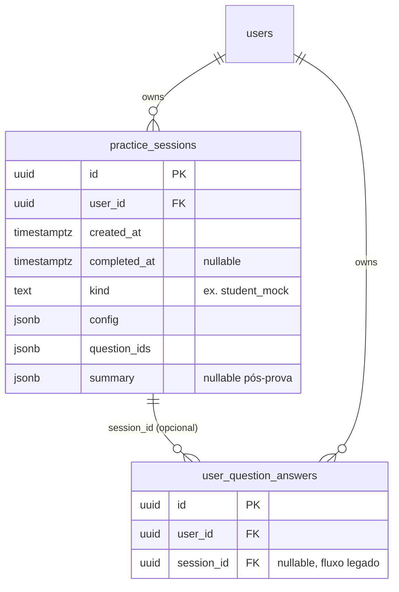
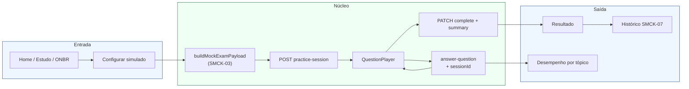
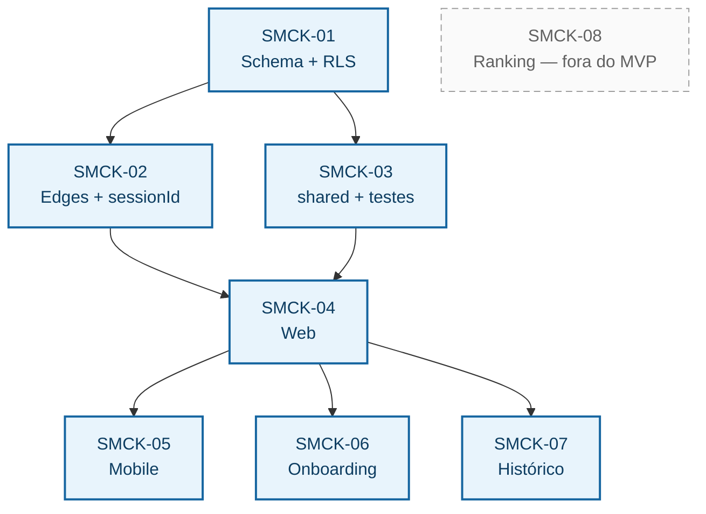

# Plano: Simulado ENEM (aluno cria e faz)

**Origem:** [broto-sistema-completo.md](./broto-sistema-completo.md) (linhas 356–361)  
**Escopo deste documento:** apenas o simulado **autogerido pelo aluno** (não inclui fluxo do professor/turma — item separado no mesmo doc).  
**Branch:** `plan/simulado-enem-aluno`  
**Rastreio GSD:** requisitos **SMCK-01** … **SMCK-08** em [.planning/REQUIREMENTS.md](../.planning/REQUIREMENTS.md); tarefas em [.planning/phases/feat-simulado-enem-aluno/PLAN.md](../.planning/phases/feat-simulado-enem-aluno/PLAN.md).

### Convenção de IDs (time Broto)

O time padroniza requisitos como **`PREFIXO-NN`**: exatamente **quatro letras**, hífen, **dois dígitos** (`01` … `99`), listados e atualizados em `REQUIREMENTS.md`. Cada família tem um prefixo estável (ex.: **TOOL-** tooling, **CONS-** consolidação, **ONBR-** onboarding). O escopo **simulado autogerido pelo aluno** usa o prefixo **SMCK** (*student mock*), **SMCK-01** … **SMCK-08**. Interseções com outras famílias aparecem no texto (ex.: **ONBR-02** para o diagnóstico pós-onboarding).

---

## 1. Objetivo do produto

Permitir que o aluno **monte um simulado personalizado** (quantidade, áreas, tópicos, dificuldade opcional) ou modo aleatorio (todas as areas dificuldades topicos aluno escolhe somente quantidade de questoes), que o sistema **monte uma lista única de questões** a partir do **mesmo banco/corpus** já usado no app (storage estático ENEM + mapeamento tópico), que o aluno **resolva na experiência de player** já existente e que o **resultado** apareça de forma clara e **alimente indicadores** (percentual, por área/tópico, tempo médio; ranking/percentis como extensão opcional).

**Referência de UX:** fluxo descrito em [onboarding-flow.md](./onboarding-flow.md) para o *simulado diagnóstico* (20 questões fixas, 5 por área) — aqui a configuração é **flexível**, mas a experiência de prova e o pós-prova devem reutilizar o mesmo padrão visual e de navegação sempre que fizer sentido.

---

## 2. Estado atual do código (âncoras)

| Peça | Situação |
|------|-----------|
| Onboarding — CTA “Simulado diagnóstico” | `TODO`: não navega para quiz (`apps/mobile/app/onboarding.tsx`, `apps/web/src/pages/Onboarding.tsx`). |
| Corpus de questões | JSON em Storage (`useQuestionsFilters` / `use-questions-filters`: `areas.json`, `exams.json`, `{ano}/details.json`, `question-topic-mapping.json`). |
| Tipos | `Question`, `getQuestionId`, filtros — `@broto/shared` (`packages/shared/src/types/question.ts`). |
| Resposta + indicadores base | Edge `answer-question`: `user_question_answers` (+ `tempo_resposta`), `topic_performance`, pet/streak. |
| Progresso agregado | Edge `user-progress` lê `topic_performance` (e fallbacks). |

**Implicação:** o pipeline de **registrar resposta** já alimenta performance por tópico; o que falta para “simulado” é principalmente **(A)** seleção/geração da lista sob critérios do aluno, **(B)** agrupar a tentativa como **sessão** para relatório e navegação, **(C)** telas de configuração + resultado consolidado.

---

## 3. Requisitos funcionais (MVP)

1. **Configuração:** aluno define `nQuestoes` (com limites min/max razonáveis), **área(s)** ENEM, opcionalmente **tópico(s)** (multi-seleção alinhada aos filtros atuais), **ano(s)** ou “qualquer ano” dentro do range já suportado, **idioma** quando aplicável (Linguagens), **dificuldade opcional** se os metadados existirem ou via regra documentada (ver §6). Atalho **modo aleatório:** apenas `nQuestoes` e filtros globais (ex.: anos/idioma); áreas/tópicos/dificuldades saem da amostragem sobre o corpus permitido.
2. **Geração:** conjunto **sem repetição** de `question_id`; se o pool filtrado for menor que `nQuestoes`, avisar e sugerir afrouxar filtros ou reduzir quantidade.
3. **Execução:** mesmo fluxo que “estudo por lista” — reutilizar `QuestionPlayer` (web/mobile) com lista pré-montada; registrar respostas com `answer-question` (mantém XP/indicadores atuais).
4. **Resultado imediato:** percentual geral, acertos **por área** e **por tópico** (quando mapeado), **tempo médio** por questão (e total), opção de ver gabarito com áudio/texto já existentes no player conforme produto atual.
5. **Histórico (MVP+):** lista de simulados anteriores com data e nota/percentual (depende de persistência de sessão — §5).

**Fora do MVP inicial (backlog explícito):** ranking global e percentis (exige agregações entre usuários, política de privacidade/LGPD e custo de queries).

| Tema funcional (§3) | Requisito |
|---------------------|-----------|
| Configuração + atalho aleatório | **SMCK-03**, **SMCK-04**, **SMCK-05** |
| Geração (sem repetição, pool &lt; N) | **SMCK-03** |
| Execução no player + `answer-question` | **SMCK-02**, **SMCK-04**, **SMCK-05** |
| Resultado imediato (%, área, tópico, tempo) | **SMCK-02**, **SMCK-04**, **SMCK-05** |
| Histórico | **SMCK-07** |
| Ranking / percentis | **SMCK-08** (deferred) |

---

## 4. Requisitos não funcionais

- **Paridade web + mobile** na configuração e no player (mesma regra de geração em `@broto/shared`).
- **Determinismo opcional:** seed compartilhável (ex.: “refazer mesmo simulado”) pode ser fase 2; MVP pode usar shuffle pseudoaleatório com `session_id` + seed armazenada.
- **Performance:** geração no cliente é aceitável enquanto o corpus continuar em JSON estático; se o volume crescer, migrar seleção para edge + cache.

---

## 5. Modelo de dados proposto

**Problema:** hoje cada resposta é uma linha em `user_question_answers` **sem** vínculo explícito a uma “prova”.

**Opção recomendada (MVP):**

- Nova tabela `practice_sessions` (nome final a alinhar ao glossário do produto):

  - `id` (uuid), `user_id`, `created_at`, `completed_at` (nullable),
  - `kind` = `'student_mock'` (enum/texto; reserva para `'class_assignment'` no futuro),
  - `config` (jsonb): critérios escolhidos pelo aluno,
  - `question_ids` (text[] ou jsonb): ordem fixa da prova,
  - `summary` (jsonb, nullable): snapshot pós-conclusão (percentual, por área, tempos) para dashboard rápido.

- Opcional: coluna `session_id` em `user_question_answers` (FK) **ou** tabela de junção `practice_session_answers` — a primeira opção simplifica consultas e migração incremental.

**RLS:** políticas no mesmo espírito de `user_question_answers` (dono lê/escreve; staff conforme matriz PR08).

**Alternativa mais enxuta (só se quiser evitar migração no primeiro slice):** sessão apenas em memória/localStorage + relatório pontual; **não** recomendado se o objetivo é histórico e consistência multi-dispositivo.

### Diagrama — modelo alvo (MVP)

---

## 6. Dificuldade opcional

Verificar nos assets (`details.json` / questão completa) se já existe campo de dificuldade. Se **não** existir:

- MVP: ocultar filtro de dificuldade **ou** mapear heurística documentada (ex.: proporção por ano, posição na prova) e marcar na UI como “experimental”.
- Evitar inventar rótulos que não existem nos dados sem validação pedagógica.

---

## 7. Camada de aplicação

### 7.1 Lógica compartilhada (`@broto/shared`)

- `buildMockExamPayload(config): { questionIds: string[], questions: Question[] }` — recebe o mesmo shape de filtros que o app já entende + regras de amostragem (estratificação por área quando o aluno escolhe múltiplas áreas).
- Tipos: `StudentMockExamConfig`, `StudentMockExamSession` (espelhando colunas essenciais da tabela).

### 7.2 Edge functions

- **`practice-session-create` (POST):** valida config, persiste linha em `practice_sessions`, devolve `sessionId` + lista ordenada de ids (ou só ids se o cliente hidratar do storage).
- **`practice-session-complete` (PATCH):** ao encerrar, grava `summary`, `completed_at` (idempotente).
- **Ou** combinar em um único recurso REST-like sob `/api/practice-session/*` seguindo `pathToFunctionName`.

Registro de cada resposta continua em **`answer-question`**; estender payload com `sessionId` opcional para preencher `user_question_answers.session_id` quando a migração existir.

### 7.3 Apps (web + mobile)

- Nova rota/página: **Configurar simulado** (entrada a partir de Estudo/Home/Menu — definir ponto único de navegação com produto).
- Reutilizar componentes de seleção de área/tópico já usados em `questions` / `StudyArea` onde possível.
- Player: passar `initialQueue` + `onSessionComplete` para fechar sessão e navegar para **Resultado**.
- Onboarding: trocar `TODO` por navegação para **fluxo de simulado** com config **fixa** equivalente ao diagnóstico (20q / 5 por área) ou deep link para nova tela com defaults pré-preenchidos.

### Diagrama — fluxo ponta a ponta

---

## 8. Indicadores e tela de progresso

- **Automático:** cada `answer-question` já atualiza `topic_performance` e pet — o simulado **melhora** os mesmos gráficos de desempenho por tópico.
- **Específico do simulado:** agregações em `practice_sessions.summary` para cards “último simulado”, evolução no tempo (lista por `created_at`).
- **Ranking/percentis:** planejar como fase posterior — materialized view ou edge dedicada, amostra mínima, opt-in do aluno.

---

## 9. Ordem de implementação sugerida

1. Migração + RLS: `practice_sessions`, opcional `user_question_answers.session_id`.
2. Funções edge: criar/atualizar sessão; estender `answer-question` com `sessionId`.
3. `@broto/shared`: tipos + `buildMockExamPayload` + testes unitários (amostragem, dedup, edge cases de pool pequeno).
4. Web: tela config + resultado + integração player.
5. Mobile: paridade.
6. Onboarding: ligar CTA ao fluxo com defaults diagnósticos.
7. Polish: histórico, seed/compartilhar, acessibilidade e cópia em PT-BR.

### Mapa SMCK ↔ ordem (espelha PLAN.md)

Na prática **SMCK-02** e **SMCK-03** seguem **SMCK-01** em paralelo; **SMCK-04** só fecha quando ambos + amostragem estável.

*Setas = dependência lógica de entrega, não calendário. **SMCK-08** permanece em backlog.*

---

## 10. Critérios de aceite (UAT resumido)

- Com filtros válidos, o aluno obtém **N** questões distintas e consegue concluir o fluxo sem erro.
- Respostas aparecem em **Desempenho**/progresso por tópico após o simulado (como no fluxo normal de questões).
- Ao finalizar, o aluno vê **percentual**, **por área**, **tempo médio**, e a sessão fica registrada (quando persistência implementada).
- Com pool insuficiente, mensagem clara e nenhum crash.
- Web e mobile comportam-se de forma equivalente nos mesmos critérios de geração.

---

## 11. Riscos e dependências

- **Corpus estático:** mudança de estrutura dos JSONs quebra filtros — versionar contrato ou testes de snapshot leves.
- **Duplicação lógica:** manter amostragem **só** em `shared` para não divergir web/mobile.
- **LGPD:** ranking futuro exige base legal e configurações de privacidade explícitas.
- **Alinhamento com simulado do professor:** usar `kind` e `config` genéricos na mesma tabela reduz retrabalho quando a feature 365–369 do mesmo doc for implementada.

---

## 12. Próximos passos operacionais

1. Executar tarefas em `PLAN.md` (wave 1) com commits atômicos por SMCK quando possível.
2. Validar com produto: limites de N, defaults do diagnóstico no onboarding, e se gabarito é imediato ou só ao final.