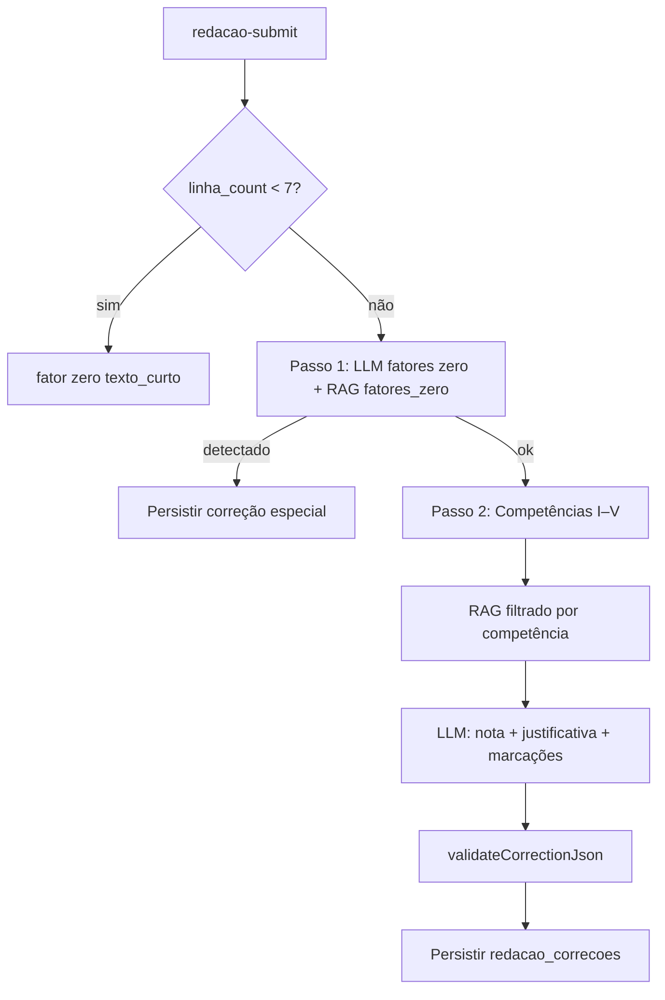

# Arquitetura — Motor de correção de redação ENEM

**Status:** aprovado para revisão · **Julho 2026**  
**Documentos relacionados:** [`redacao.md`](./redacao.md) (produto) · [`redacao-contexto-dev.md`](./redacao-contexto-dev.md) (contexto dev) · [`.planning/phases/redacao-enem/PLAN.md`](../.planning/phases/redacao-enem/PLAN.md) (execução)

---

## 1. Objetivo

Implementar correção de redação dissertativo-argumentativa ENEM ancorada na **Cartilha do Participante INEP** via RAG, com nota por competência (0–200, múltiplos de 40), justificativas, marcações inline e checagem de fatores de nota zero.

**Tese de produto:** o valor não é "corrigir rápido", e sim o ciclo **escrever → feedback específico → reescrever → evolução**.

---

## 2. Infraestrutura existente (reaproveitar)

### Pipeline RAG por turma (NÃO usar para Cartilha INEP)

```
material-index → extractMaterialContent → buildMaterialChunks (~650 tokens)
  → embedTexts (text-embedding-3-small, 1536d) → material_embeddings
  → match_material_chunks(class_id) → broto-chat (gpt-4o-mini)
```

| Peça | Arquivo | Reuso |
|------|---------|-------|
| Embeddings | `supabase/functions/_shared/openai-embeddings.ts` | Sim |
| Chunking | `supabase/functions/_shared/material-chunking.ts` | Adaptar metadata |
| Retrieval | `supabase/functions/_shared/semantic-search-core.ts` | Padrão + nova RPC |
| Contexto RAG | `supabase/functions/_shared/rag-context.ts` | Novos builders de prompt |
| LLM | `supabase/functions/_shared/openai-chat.ts` | Estender temp + JSON |
| Authz/CORS | `_shared/authz.ts`, `_shared/cors.ts` | Obrigatório |

### O que NÃO reutilizar para correção

- `material_embeddings` — corpus por turma, mistura materiais do professor com norma INEP
- NotebookLM — documento fixo; pgvector basta
- Prompts de chat (`buildRagSystemPrompt`) — correção exige JSON estruturado

---

## 3. Decisão crítica: corpus RAG separado

### Tabelas

```sql
enem_reference_documents (
  id uuid PK,
  slug text UNIQUE,           -- ex: 'cartilha-participante-2025'
  title text,
  source_url text,
  version text,               -- ex: '2025.1'
  indexed_at timestamptz
)

enem_reference_embeddings (
  id uuid PK,
  document_id uuid FK,
  chunk_index int,
  chunk_text text,
  embedding extensions.vector(1536),
  metadata jsonb NOT NULL DEFAULT '{}',
  UNIQUE (document_id, chunk_index)
)
```

### RPC

```sql
match_enem_reference_chunks(
  query_embedding extensions.vector(1536),
  match_competence text DEFAULT NULL,   -- 'I'|'II'|'III'|'IV'|'V'|NULL
  match_section text DEFAULT NULL,      -- 'matriz_referencia'|'fatores_zero'|...
  match_count int DEFAULT 5,
  similarity_threshold float DEFAULT 0.5
)
```

- RLS fail-closed (só `service_role`, como `material_embeddings`)
- Índice IVFFlat em `embedding`
- Fallback threshold `0.32` se vazio (padrão `semantic-search-core.ts`)

---

## 4. Indexação da Cartilha INEP

### Fonte

| Campo | Valor |
|-------|-------|
| Documento | Cartilha do Participante ENEM 2025 |
| Slug | `cartilha-participante-2025` |
| Armazenamento | PDF em bucket privado ou path local no script — **não commitar no repo** |

### Pipeline

```
PDF → extractMaterialContent (unpdf)
    → chunking semântico (por seção normativa)
    → embedTexts (batch 20)
    → upsert enem_reference_embeddings
```

**Gatilho:** `supabase/scripts/index-enem-cartilha.ts` (deploy inicial) + edge `enem-reference-index` (reindex admin).

### Metadata por chunk

| `metadata.section` | `metadata.competencia` | Conteúdo |
|--------------------|------------------------|----------|
| `matriz_referencia` | `I`…`V` | Níveis 0/40/80/120/160/200 |
| `fatores_zero` | null | Anulação completa |
| `estrutura_textual` | `II` | Dissertativo-argumentativo |
| `proposta_intervencao` | `V` | Agente, ação, meio, finalidade, detalhamento |
| `repertorio` | `II` | Repertório produtivo vs. de bolso |

Chunks de matriz incluem `{ criterio_nivel: 0|40|80|120|160|200 }` quando aplicável.

### Segmentação

1. Extrair headings do PDF (Competência I–V, Fatores de anulação)
2. Cada seção → 1+ chunks (subdividir se >800 tokens por nível de nota)
3. Não usar janela fixa de 650 tokens cegamente — priorizar unidades normativas

---

## 5. Modelo de dados

Ver migrations detalhadas em [`redacao-contexto-dev.md` §4](./redacao-contexto-dev.md). Resumo:

| Tabela | Propósito |
|--------|-----------|
| `redacao_temas` | Situação-problema + motivadores próprios |
| `redacoes` | Texto do aluno, linhas, status |
| `redacao_correcoes` | Notas, justificativas, marcações, fatores zero |
| `redacao_revisoes_humanas` | Calibração cega IA vs. humano |
| `redacao_repertorios` | Conteúdo pedagógico do professor |
| `redacao_competence_snapshots` | Série temporal para rotina/evolução |

### Schema `marcacoes_inline`

```typescript
type MarcacaoInline = {
  start_offset: number
  end_offset: number
  trecho: string
  tipo_problema: string
  comentario: string
  competencia: 'I' | 'II' | 'III' | 'IV' | 'V'
}
```

### Validação pós-LLM (`packages/shared/src/redacao/`)

- Offsets batem com `trecho` no texto
- Notas ∈ {0, 40, 80, 120, 160, 200}
- `linha_count < 7` → fator zero determinístico (sem LLM)

---

## 6. Edge functions

| Function | Método | Auth | Responsabilidade |
|----------|--------|------|------------------|
| `enem-reference-index` | POST | admin | Indexar Cartilha |
| `redacao-tema-list` | GET | student | Temas global + org |
| `redacao-repertorio-list` | GET | student | Repertórios visíveis |
| `redacao-repertorio-manage` | POST/PATCH/DELETE | teacher+ | CRUD repertórios |
| `redacao-submit` | POST | student | Validar + persistir + disparar correção |
| `redacao-correct` | POST | internal | Motor de correção |
| `redacao-get` | GET | student/teacher | Redação + correção |
| `redacao-history` | GET | student | Histórico + evolução |
| `redacao-revisao-humana` | POST | staff | Calibração cega |

Padrão: `cors` → `requireUser` → validar UUID → `requireClassAccess` → `service_role` após authz.

---

## 7. Motor de correção — pipeline de prompts

### Decisões registradas

| Decisão | Escolha | Motivo |
|---------|---------|--------|
| Chamadas LLM | **6 sequenciais** (1 zero-check + 5 competências) | RAG filtrado + calibração por competência |
| Submit | **Sync com timeout ~45s** no MVP | Simplicidade; async na v2 se latência inaceitável |
| Temperatura | **0.1** | Consistência |
| Output | **`response_format: json_object`** | Frontend tipado |

### Fluxo



### Passo 1 — Fatores de nota zero

System prompt ancorado em trechos `section=fatores_zero`. Output JSON:

```json
{
  "detectado": false,
  "motivos": [],
  "detalhes": "...",
  "evidencias": [{ "trecho": "...", "start_offset": 0, "end_offset": 10 }]
}
```

Motivos canônicos: `fuga_tema`, `texto_curto`, `copia_motivadores`, `lingua_estrangeira`, `identificacao_candidato`, `nao_dissertativo`.

### Passo 2 — Por competência

Para cada `I`…`V`:

1. Query embedding = competência + trecho da redação + tema
2. `match_enem_reference_chunks(..., match_competence='X')`
3. System: matriz da competência + instruções de nota discreta
4. User: tema + motivadores + texto completo
5. Output JSON por competência

**Competência V — instrução obrigatória:**

> Avalie ESTRUTURA (agente, ação, meio, finalidade, detalhamento) e compatibilidade com direitos humanos. NÃO penalize posição política legítima.

### Pós-processamento shared

- `validateCorrectionJson()`
- `normalizeMarcacoes(texto, marcacoes)` — fuzzy match se offset errado
- `clampNota(n)` — múltiplo de 40
- `aggregateCorrecao(results[])` — soma + merge marcações

### Audit trail

Persistir em `redacao_correcoes`:

- `prompt_version` (ex: `redacao-correct-v1.0`)
- `modelo_usado`
- `rag_chunks_used` (ids + similarity)

---

## 8. Frontend (rotas)

```
/redacao                         → temas + histórico
/redacao/tema/:temaId            → editor (7–30 linhas, timer, repertórios)
/redacao/resultado/:redacaoId    → feedback inline
/redacao/evolucao                → gráfico por competência
```

Admin: aba Redação em `ClassDetail` — CRUD repertórios.

---

## 9. Integração rotina Broto

Gatilho: média competência X < **120** nas últimas **3** redações.

Payload em `routine-generate`: `redacao_weak_competences: ('I'|'II'|...)[]`

Domínio **paralelo** a `topic_performance` — não duplicar BKT; convergir na rotina.

---

## 10. RLS (resumo)

| Recurso | Leitura | Escrita |
|---------|---------|---------|
| `redacao_temas` global | autenticados | service_role |
| `redacao_temas` org | alunos org | teacher+ |
| `redacoes` | aluno + teacher+ | aluno |
| `redacao_correcoes` | mesmo que redação | edge |
| `redacao_repertorios` | alunos org/turma | teacher+ |
| `redacao_revisoes_humanas` | staff | staff |
| `enem_reference_*` | service_role | deploy |

---

## 11. Gates de lançamento

- [ ] RAG ancorado na Cartilha (não LLM genérica)
- [ ] Variância documentada (mesma redação N=10, σ < 20 pts/competência)
- [ ] Calibração humana com concordância IA vs. humano
- [ ] Fatores zero testados (incl. `linha_count < 7`)
- [ ] Competência V estrutural, não política
- [ ] Marcações inline validadas com aluno real
- [ ] Repertórios visíveis no editor e pós-correção
- [ ] Sem reprodução de motivadores/redações nota 1000 INEP

---

## 12. Métricas de qualidade do motor

| Métrica | Como medir | Meta inicial |
|---------|------------|--------------|
| Consistência | Mesma redação 10× | σ < 20 pts/competência |
| Calibração | Revisão humana cega | Diferença média absoluta < 40 pts |
| Fatores zero | Suite de testes | 100% nos casos determinísticos |
| Marcações | Offsets válidos | >95% após normalizeMarcacoes |

---

## 13. Referências de código

- RAG chat: `supabase/functions/broto-chat/index.ts`
- Indexação: `supabase/functions/_shared/material-rag-index.ts`
- Migration pgvector: `supabase/migrations/20260626120000_material_embeddings_rag.sql`
- Template edge: `.cursor/rules/05-supabase-functions.mdc`
- Multi-tenant: `docs/multi-tenant/multi-tenant-permissions-matrix.md`
