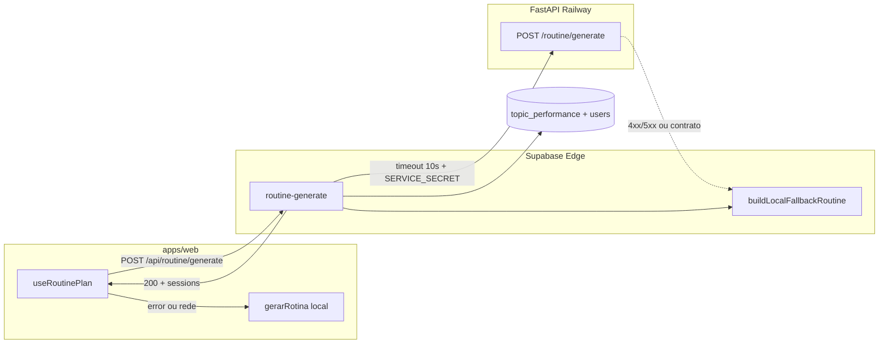

# Rotina inteligente — `routine-generate`

Documentação da integração entre o app web, a Edge Function `routine-generate` e o serviço FastAPI Python (`supabase/services/notebooklm/`).

**Status (2026-06):** Edge Function em produção com fallback local robusto. O FastAPI é tentado quando há URL configurada, mas o **contrato de payload ainda difere** do `main.py` — ver [Contrato FastAPI](#contrato-fastapi-edge-vs-python). Até alinhar, produção usa fallback local na edge na prática.

---

## Visão geral

| Camada | Responsabilidade |
|--------|------------------|
| **Web** (`useRoutinePlan`) | Chama `/api/routine/generate`; se falhar, usa `gerarRotina` local |
| **Edge** (`routine-generate`) | Lê `topic_performance` + perfil; tenta FastAPI; fallback por `p_know` |
| **FastAPI** (`POST /routine/generate`) | Rotina enriquecida via NotebookLM (quando contrato estiver alinhado) |
| **Shared** (`gerarRotina`) | Rotina semanal determinística (7 dias, padrão de áreas) |

A persistência de **`p_know`** em `topic_performance` é feita por `answer-question` (BKT). A edge usa esse campo para priorizar tópicos no fallback.

---

## Arquitetura



---

## Fallback em três camadas

1. **FastAPI** — se `resolveFastApiServiceUrl()` retornar URL e a chamada responder `200` com corpo válido → `_source: "fastapi"`.
2. **Edge local** — se FastAPI indisponível, timeout (>10s), erro HTTP ou URL vazia → ordena tópicos por `p_know` ascendente (até 5 sessões) → `_source: "local_fallback"`.
3. **Cliente web** — se a Edge Function falhar (rede, 401, 500) → `useRoutinePlan` chama `gerarRotina(areas, horasPorDia)` → prioridade por acerto das áreas (UI inalterada).

O web reordena áreas conforme `sessions` da edge (`applySessionPriorityToAreas`) antes de montar a grade semanal com `gerarRotina`.

---

## Secrets e URL do serviço

Secrets no **Supabase Dashboard → Edge Functions → Secrets** (nunca commitar valores).

| Secret | Obrigatório | Uso |
|--------|-------------|-----|
| `NOTEBOOKLM_SERVICE_URL` | Sim (chat/materiais) | URL base do FastAPI Python no Railway |
| `SERVICE_SECRET` | Sim (prod) | `Authorization: Bearer …` nas chamadas ao Python |
| `FASTAPI_URL` | **Opcional** | Override só para `routine-generate` |

### Resolução da URL (`resolveFastApiServiceUrl`)

Ordem em `supabase/functions/_shared/routine-generate.ts`:

1. `FASTAPI_URL` — se definido e não vazio
2. `NOTEBOOKLM_SERVICE_URL` — **mesmo host** (`/routine/generate` vive no serviço NotebookLM)
3. string vazia → pula FastAPI e usa fallback local na edge

**Produção atual:** `NOTEBOOKLM_SERVICE_URL` já está configurado; **não é necessário** duplicar em `FASTAPI_URL` salvo override explícito.

```bash
# Opcional — só se quiser URL diferente da do NotebookLM
supabase secrets set FASTAPI_URL="https://seu-servico.railway.app"
```

O CLI **não expõe** valores de secrets (apenas digest). Para copiar a URL, use o Dashboard.

Referência local: `supabase/functions/.env.example` (dev com `host.docker.internal:8000`).

---

## Contrato FastAPI: edge vs Python

### O que a edge envia hoje

`POST {baseUrl}/routine/generate`

Headers:

```http
Content-Type: application/json
Authorization: Bearer {SERVICE_SECRET}
```

Body (exemplo):

```json
{
  "user_id": "uuid",
  "hours_per_day": 2,
  "exam_date": "2026-11-08",
  "target_score": 700,
  "performance": [
    {
      "topic": "funcoes",
      "area": "matematica",
      "p_know": 0.35,
      "p_know_confidence": "medium",
      "accuracy": 42,
      "practiced": true
    }
  ]
}
```

Confiança de `p_know`: `low` (&lt;3 respostas), `medium` (3–7), `high` (≥8), baseada em `total_answered`.

### O que o Python espera (`main.py`)

```json
{
  "class_id": "uuid-da-turma",
  "user_id": "uuid",
  "hours_per_day": 3,
  "exam_date": "2026-11-08",
  "performance": {
    "linguagens": { "accuracy": 0.72, "weak_topics": ["…"] },
    "matematica": { "accuracy": 0.48, "weak_topics": ["…"] }
  }
}
```

Resposta Python: `{ "routine": RoutineWeekData, "message": "…" }` — **não** o formato `{ sessions, source, generated_at }` do fallback edge.

### Consequência

Com o contrato atual, chamadas ao FastAPI tendem a retornar **422/404** (falta `class_id`, formato de `performance` diferente). A edge trata isso como falha e **cai no fallback local** — comportamento seguro.

**Próximo passo de engenharia:** adaptar payload/response na edge ou evoluir `main.py` para aceitar lista de tópicos com `p_know` (e aluno ENEM sem turma).

---

## Arquivos no monorepo

| Arquivo | Função |
|---------|--------|
| `supabase/functions/routine-generate/index.ts` | Handler HTTP |
| `supabase/functions/_shared/routine-generate.ts` | Payload, fetch FastAPI, fallback local |
| `supabase/functions/_shared/routine-generate_test.ts` | Testes Deno |
| `packages/shared/src/routine/routine-generate-api.ts` | Tipos + `applySessionPriorityToAreas` |
| `packages/shared/src/routine/generate-routine.ts` | `gerarRotina` (grade semanal) |
| `apps/web/src/hooks/useRoutinePlan.ts` | Hook web + fallback cliente |
| `apps/web/src/pages/Home.tsx`, `Routine.tsx` | Consumidores |
| `supabase/services/notebooklm/main.py` | FastAPI `/routine/generate` |

---

## Dados de entrada (edge)

### `topic_performance`

Colunas usadas (schema real):

| Coluna edge | Notas |
|-------------|--------|
| `topico_value` | Identificador do tópico (não `topic_key`) |
| `area_key` | Área ENEM |
| `p_know` | Persistido por `answer-question` |
| `accuracy_pct` | Acerto agregado |
| `total_answered` | Usado para confiança do `p_know` |

### `users`

`hours_per_day`, `exam_date`, `target_score`, `strong_areas`, `weak_areas` (onboarding 3.2).

RLS: client autenticado via `requireUser` → `supabaseAuthed` (sem `service_role` nesta function).

---

## Testes

```bash
# Lógica da edge (fallback, timeout, resolução de URL)
deno test supabase/functions/_shared/routine-generate_test.ts --allow-env

# Shared (prioridade de áreas no web)
npm run test:shared
# inclui packages/shared/src/routine/routine-generate-api.test.ts
```

Casos cobertos:

- Fallback local ordena `sessions` por `p_know` **ascendente**
- `fetchFastApiRoutine` aborta antes de 10s (mock ~50ms)
- `resolveFastApiServiceUrl` prioriza `FASTAPI_URL` sobre `NOTEBOOKLM_SERVICE_URL`

---

## Deploy

**Sempre faça backup** antes de alterar functions ou secrets em produção:

```bash
mkdir -p .backup/pre-<descricao>-$(date +%Y%m%d)
cp -R supabase/functions/_shared .backup/pre-<descricao>-$(date +%Y%m%d)/
```

### Só `routine-generate`

```bash
supabase login
supabase link --project-ref lfhsugwhnjqudqomzegp
supabase functions deploy routine-generate --no-verify-jwt
```

### Todas as functions (20)

```bash
./scripts/deploy-functions.sh
```

`--no-verify-jwt`: gateway Supabase rejeita JWT ES256; auth continua em `requireUser()` no handler. Ver `docs/deploy-functions.md`.

---

## Smoke test pós-deploy

1. Login em [brotoenem.com.br](https://www.brotoenem.com.br/login)
2. Abrir **Home** ou **Rotina** → DevTools → Network
3. Confirmar `POST …/functions/v1/routine-generate` → **200**
4. Corpo inclui `sessions`, `_source` (`fastapi` ou `local_fallback`)
5. Com `FASTAPI_URL`/`NOTEBOOKLM` inválido: resposta em **&lt;10s** (sem travar UI)

Invocação manual (substituir JWT):

```bash
curl -s -X POST \
  "https://lfhsugwhnjqudqomzegp.supabase.co/functions/v1/routine-generate" \
  -H "Authorization: Bearer SEU_ACCESS_TOKEN" \
  -H "apikey: SUA_ANON_KEY" \
  -H "Content-Type: application/json"
```

---

## Meta diária na Home (missões)

O card **Meta hoje** no `DailyStreakCard` mede **missões concluídas** (`X / 3 missões`), não questões brutas. Regras em `apps/web/src/lib/build-daily-missions.ts`, alinhadas a `supabase/functions/_shared/daily-mission-bonus.ts`. Constante: `DAILY_MISSION_SLOT_COUNT = 3` em `@broto/shared`.

---

## Troubleshooting

| Sintoma | Causa provável | Ação |
|---------|----------------|------|
| `_source: local_fallback` sempre | Contrato Python incompatível ou FastAPI down | Esperado até alinhar contrato; ver logs `[routine-generate]` |
| Timeout ~10s | Railway lento ou URL errada | Verificar `NOTEBOOKLM_SERVICE_URL`, `/health` |
| 401 no Python | `SERVICE_SECRET` ausente/errado | `supabase secrets set SERVICE_SECRET=…` |
| 404 no Python | `class_id` / notebook não mapeado | Normal com payload atual sem turma |
| Web usa só rotina local | Edge 401/500 ou rede | Ver CORS, JWT, `ALLOWED_ORIGINS` |
| `p_know` sempre ~0.3 | Pouco histórico em `topic_performance` | Responder questões via `answer-question` |

---

## Referências

- [Deploy Edge Functions](./deploy-functions.md)
- [Serviço NotebookLM / FastAPI](../supabase/services/notebooklm/README.md)
- [ADR timezone UTC](./adr/001-timezone-utc.md) — rotina semanal e streak
- `.cursor/rules/05-supabase-functions.mdc`
